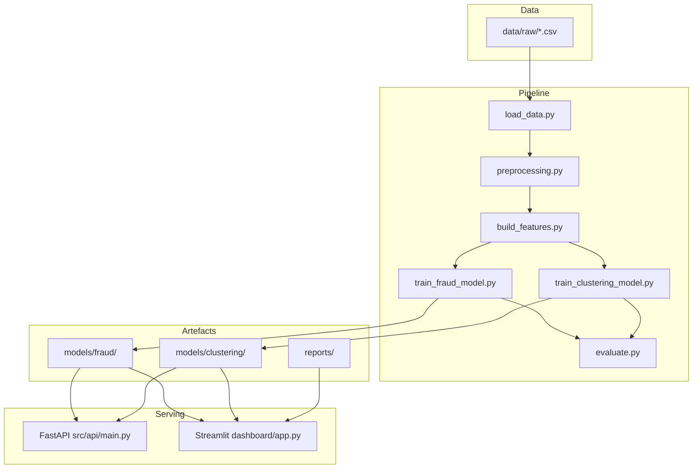

# Projet Machine Learning M2 CDSD

**Data Science · Détection de fraude · Segmentation client · MLOps**

Projet académique visant à construire une démarche complète de Machine Learning autour de deux cas d'usage complémentaires : la **détection automatique de transactions frauduleuses** (classification supervisée) et la **segmentation intelligente de clients** (clustering), avec une couche d'**industrialisation** (API, dashboard, Docker, CI).

**Auteur :** Kokou Godwin TCHAKPANA — M2 CDSD  
**Livrables clés :** [rapport PDF](reports/rapport_technique.pdf) · [présentation PPTX](reports/presentation_finale.pptx)

## Demo en ligne

| Service | URL |
|---------|-----|
| **Dashboard Streamlit** | [https://kokou-ml.streamlit.app/](https://kokou-ml.streamlit.app/) |
| **API (accueil)** | [https://kokou-ml.onrender.com/](https://kokou-ml.onrender.com/) |
| **API (Swagger /docs)** | [https://kokou-ml.onrender.com/docs](https://kokou-ml.onrender.com/docs) |
| **Health check** | [https://kokou-ml.onrender.com/health](https://kokou-ml.onrender.com/health) |

> Sur le plan gratuit Render, la première requête après inactivité peut prendre ~30–60 s (cold start).

---

## Table des matières

1. [Contexte et objectifs](#contexte-et-objectifs)
2. [Spécifications du projet](#spécifications-du-projet)
3. [Architecture](#architecture)
4. [Structure du dépôt](#structure-du-dépôt)
5. [Données](#données)
6. [Pipeline Machine Learning](#pipeline-machine-learning)
7. [Résultats obtenus](#résultats-obtenus)
8. [Installation et exécution](#installation-et-exécution)
9. [API de prédiction](#api-de-prédiction)
10. [Dashboard interactif](#dashboard-interactif)
11. [Tests](#tests)
12. [MLOps et industrialisation](#mlops-et-industrialisation)
13. [Déploiement en ligne](#déploiement-en-ligne)
14. [Livrables](#livrables)
15. [Limites et perspectives](#limites-et-perspectives)

---

## Contexte et objectifs

Dans un contexte bancaire et marketing, l'entreprise souhaite :

- **Détecter automatiquement** les transactions frauduleuses pour limiter les pertes financières.
- **Segmenter les clients** en profils homogènes afin d'optimiser les campagnes marketing et la fidélisation.
- **Industrialiser** les modèles via une architecture reproductible et déployable.

### Objectifs Data Science

- Comprendre et documenter les jeux de données.
- Construire des pipelines de preprocessing et de feature engineering reproductibles.
- Comparer plusieurs modèles avec des métriques adaptées au problème métier.
- Interpréter les résultats et formuler des recommandations actionnables.

### Objectifs MLOps

- Organiser le code en modules réutilisables (`src/`).
- Séparer ingestion, preprocessing, entraînement, évaluation et inférence.
- Exposer les modèles via une **API FastAPI** et un **dashboard Streamlit**.
- Automatiser les tests de base (`pytest`).

---

## Spécifications du projet

### Exercice 1 — Détection de fraude

| Élément | Spécification |
|--------|----------------|
| **Fichier** | `data/raw/detection_fraude.csv` |
| **Cible** | `isFraud` (0 = normal, 1 = fraude) |
| **Volume** | ~1 048 575 transactions |
| **Contrainte majeure** | Classe fortement déséquilibrée (~0,11 % de fraudes) |
| **Modèles testés** | Régression logistique, Random Forest, XGBoost, LightGBM, MLP |
| **Métriques** | PR-AUC, Recall, Precision, F1, ROC-AUC, matrice de confusion |
| **Décision métier** | Seuil calibré sur validation (contrainte de rappel minimal) |

### Exercice 2 — Segmentation client

| Élément | Spécification |
|--------|----------------|
| **Fichier** | `data/raw/data_cluster.csv` |
| **Objectif** | Identifier des groupes de clients au comportement similaire |
| **Volume** | 2 240 clients, 29 variables |
| **Modèles testés** | K-Means, Agglomerative Clustering, GMM, DBSCAN (k = 3 à 6) |
| **Métriques** | Silhouette, Davies-Bouldin, Calinski-Harabasz |
| **Livrable métier** | Profils de segments + recommandations marketing |

### Spécifications techniques

| Composant | Technologie |
|-----------|-------------|
| Langage | Python 3.10+ |
| ML | scikit-learn, XGBoost, LightGBM, SHAP |
| API | FastAPI + Uvicorn |
| Dashboard | Streamlit + Plotly |
| Notebooks | Jupyter |
| Tests | pytest |
| Sérialisation | joblib |

---

## Architecture

### Vue d'ensemble



### Flux de prédiction (inférence)

```text
Requête JSON
    → preprocessing (fraude ou cluster)
    → feature engineering
    → alignement des colonnes
    → modèle chargé (joblib)
    → probabilité / segment + métadonnées
```

### Principes de conception

- **Séparation des responsabilités** : notebooks pour l'exploration, `src/` pour le code de production.
- **Pas de fuite de données** : split train/validation/test stratifié ; exclusion de `isFlaggedFraud` à l'entraînement fraude.
- **Métriques orientées métier** : PR-AUC et recall pour la fraude ; interprétabilité des clusters pour le marketing.
- **Reproductibilité** : seeds fixées, artefacts versionnés dans `models/`.

---

## Structure du dépôt

```text
.
├── README.md                          # Documentation principale (ce fichier)
├── SUIVI_AMELIORATIONS.md             # Suivi post-audit des améliorations
├── OLD_README.md                      # Cahier des charges / notes détaillées
├── Dockerfile
├── docker-compose.yml
├── .github/workflows/ci.yml
├── docs/
│   ├── MONITORING.md
│   └── CAMPAGNE_CLUSTER1.md           # Protocole A/B cluster promo
├── scripts/
│   ├── check_ml_health.py
│   └── generate_deliverables.py       # PDF + PPTX
├── data/
│   ├── raw/                           # Données brutes (CSV)
│   ├── processed/                     # Données transformées (optionnel)
│   └── external/
├── notebooks/
│   ├── 01_eda_fraude.ipynb
│   ├── 02_modelisation_fraude.ipynb
│   ├── 03_eda_segmentation.ipynb
│   └── 04_modelisation_segmentation.ipynb
├── src/
│   ├── data/
│   │   ├── load_data.py
│   │   └── preprocessing.py
│   ├── features/
│   │   └── build_features.py
│   ├── models/
│   │   ├── train_fraud_model.py
│   │   ├── train_clustering_model.py
│   │   ├── fraud_experiments.py       # Temporel, erreurs, coûts FP/FN
│   │   └── evaluate.py
│   ├── visualization/
│   │   ├── generate_report_figures.py
│   │   └── plots.py
│   └── api/
│       └── main.py
├── models/
│   ├── fraud/                         # Modèles et métriques fraude
│   └── clustering/                      # Modèles et profils clusters
├── dashboard/
│   └── app.py
├── reports/
│   ├── figures/
│   ├── presentation_outline.md
│   ├── presentation_finale.pptx
│   └── rapport_technique.md           # Rapport d'analyse (+ .pdf)
└── tests/
    ├── conftest.py
    ├── test_preprocessing.py
    └── test_api.py
```

---

## Données

### Détection de fraude (`detection_fraude.csv`)

| Variable | Description |
|----------|-------------|
| `step` | Unité temporelle de la transaction |
| `type` | Type (`PAYMENT`, `TRANSFER`, `CASH_OUT`, …) |
| `amount` | Montant transféré |
| `nameOrig` / `nameDest` | Identifiants émetteur / destinataire |
| `oldbalanceOrg` / `newbalanceOrig` | Soldes émetteur avant / après |
| `oldbalanceDest` / `newbalanceDest` | Soldes destinataire avant / après |
| `isFraud` | **Cible** (1 = fraude) |
| `isFlaggedFraud` | Indicateur système (exclu du modèle) |

**Observations clés (EDA)** : fraude très rare ; concentration sur `TRANSFER` et `CASH_OUT` ; incohérences de soldes fréquentes.

### Segmentation client (`data_cluster.csv`)

| Catégorie | Variables |
|-----------|-----------|
| Démographie | `Year_Birth`, `Education`, `Marital_Status`, `Income`, `Kidhome`, `Teenhome` |
| Comportement | `Recency`, `MntWines`, `MntFruits`, `MntMeatProducts`, … |
| Canaux | `NumWebPurchases`, `NumCatalogPurchases`, `NumStorePurchases`, … |
| Marketing | `AcceptedCmp1–5`, `Response`, `Complain` |

**Observations clés (EDA)** : 24 valeurs manquantes sur `Income` ; colonnes constantes `Z_CostContact`, `Z_Revenue` (exclues).

> **Note** : les fichiers CSV volumineux (~78 Mo) peuvent être versionnés via **Git LFS** — voir [`data/README.md`](data/README.md) pour les instructions.

---

## Pipeline Machine Learning

### Fraude

1. Nettoyage (`preprocess_fraud`)
2. Feature engineering : écarts de soldes, ratios, flags (`is_transfer_or_cashout`, …)
3. Split stratifié train / validation / test (70 % / 15 % / 15 %)
4. Entraînement comparatif (LogReg, RF, XGBoost, LightGBM, MLP)
5. Calibration du seuil sur validation (rappel minimal ≥ 75 %)
6. Évaluation sur test final + validation temporelle (`step`)
7. Analyses complémentaires : erreurs FP/FN, chiffrage coûts, SHAP
8. Export : `fraud_model.joblib`, comparaisons JSON/CSV

### Segmentation

1. Imputation `Income`, exclusion colonnes constantes
2. Features métier : `Age`, `Total_Spending`, `Total_Purchases`, ratios canaux, …
3. Encodage + normalisation
4. Comparaison KMeans / Agglomerative / GMM / DBSCAN (k = 3–6)
5. Sélection du meilleur compromis (silhouette, Davies-Bouldin)
6. Profilage métier par cluster
7. Export : `cluster_model.joblib`, `cluster_profiles.csv`

---

## Résultats obtenus

### Détection de fraude — modèle retenu : **XGBoost**

| Métrique | Valeur (test) |
|----------|---------------|
| PR-AUC | **0,9904** |
| Recall | 0,9825 |
| Precision | 1,0000 |
| F1 | 0,9912 |
| Seuil calibré | 0,67 |
| Lignes d'entraînement | ~734 000 (MLP : 200 000) |
| Erreurs test (seuil retenu) | 3 FN / 0 FP |

> LightGBM testé mais non retenu (PR-AUC ~0,18 — probabilités mal calibrées sur classe rare).

Comparaison complète : `models/fraud/fraud_model_comparison.csv`  
Rapport détaillé : [`reports/rapport_technique.md`](reports/rapport_technique.md) · [PDF](reports/rapport_technique.pdf)

### Segmentation — modèle retenu : **GMM k=4**

| Métrique | Valeur |
|----------|--------|
| Silhouette | **0,2100** |
| Davies-Bouldin | 2,4230 |
| Calinski-Harabasz | 305,41 |
| Nombre de clusters | 4 |

Profils détaillés : `models/clustering/cluster_profiles.csv`

---

## Installation et exécution

### Prérequis

- Python 3.10+
- macOS (XGBoost) : `brew install libomp` si erreur OpenMP

### Installation

```bash
git clone <URL_DU_REPO>
cd projet
python -m venv .venv
source .venv/bin/activate        # Windows : .venv\Scripts\activate
pip install -r requirements.txt
```

### Reproduction complète (3 étapes)

```bash
# 1) Entraîner les modèles
python -m src.models.train_fraud_model
python -m src.models.train_clustering_model

# 2) Lancer les tests
pytest -q

# 3) Démarrer l'API ou le dashboard
uvicorn src.api.main:app --reload --host 0.0.0.0 --port 8000
# ou
streamlit run dashboard/app.py
```

### Notebooks d'analyse

```bash
jupyter notebook notebooks/01_eda_fraude.ipynb
jupyter notebook notebooks/03_eda_segmentation.ipynb
```

---

## API de prédiction

Documentation interactive : `http://127.0.0.1:8000/docs`

### Endpoints

| Méthode | Route | Description |
|---------|-------|-------------|
| `GET` | `/health` | Santé de l'API |
| `GET` | `/model/info` | Modèles chargés et seuil fraude |
| `POST` | `/predict/fraud` | Prédiction fraude |
| `POST` | `/predict/segment` | Attribution d'un segment client |

### Exemple — prédiction fraude

```bash
curl -X POST "http://127.0.0.1:8000/predict/fraud" \
  -H "Content-Type: application/json" \
  -d '{
    "payload": {
      "step": 1,
      "type": "TRANSFER",
      "amount": 1000,
      "oldbalanceOrg": 2000,
      "newbalanceOrig": 1000,
      "oldbalanceDest": 500,
      "newbalanceDest": 1500
    }
  }'
```

**Réponse type :**

```json
{
  "prediction": 1,
  "probability": 0.92,
  "threshold": 0.67,
  "model": "xgboost"
}
```

### Exemple — prédiction segment

```bash
curl -X POST "http://127.0.0.1:8000/predict/segment" \
  -H "Content-Type: application/json" \
  -d '{
    "payload": {
      "Year_Birth": 1985,
      "Education": "Graduation",
      "Marital_Status": "Single",
      "Income": 50000,
      "Recency": 20,
      "MntWines": 200,
      "NumWebPurchases": 5,
      "NumStorePurchases": 4
    }
  }'
```

---

## Dashboard interactif

Lancer :

```bash
streamlit run dashboard/app.py
```

URL locale : `http://localhost:8501`

### Pages disponibles

| Page | Contenu |
|------|---------|
| **Vue d'ensemble** | KPIs, graphiques EDA, répartition segments |
| **Fraude** | Comparaison modèles, seuil, analyses avancées (coûts, erreurs, temporel), SHAP, simulateur |
| **Segmentation** | Comparaison algorithmes, heatmap profils, PCA 2D, simulateur |
| **Recommandations** | Actions métier fraude et marketing par segment |
| **Prédiction** | Scoring transaction / client + exemples API |
| **MLOps** | Artefacts, pipeline, Docker/CI, roadmap |
| **Rapport d'analyse** | Aperçu markdown, téléchargement PDF et PPTX |

---

## Tests

```bash
pytest -q
```

| Fichier | Couverture |
|---------|------------|
| `tests/test_preprocessing.py` | Nettoyage fraude et cluster |
| `tests/test_api.py` | Endpoints `/health`, `/model/info`, payloads valides |

---

## MLOps et industrialisation

### Pipeline cible

```text
Ingestion → Validation → Preprocessing → Features → Entraînement
→ Évaluation → Sauvegarde modèle → API / Dashboard → Monitoring
```

### Éléments implémentés

- [x] Code modulaire (`src/`)
- [x] Pipelines sklearn reproductibles
- [x] Artefacts modèles (`joblib`) + métriques JSON/CSV
- [x] API FastAPI avec chargement lazy des modèles
- [x] Dashboard Streamlit de démonstration
- [x] Tests automatisés (`pytest`)
- [x] **Docker** + `docker-compose.yml` (API + dashboard)
- [x] **CI GitHub Actions** (tests + health check ML)
- [x] **Git LFS** pour `detection_fraude.csv` (voir `data/README.md`)
- [x] **Monitoring MVP** (`scripts/check_ml_health.py`, `docs/MONITORING.md`)

### Lancer avec Docker

```bash
docker compose up --build
```

| Service | URL locale |
|---------|------------|
| API | http://localhost:8000/docs |
| Dashboard | http://localhost:8501 |

### Évolutions possibles

- MLflow pour le tracking d'expériences
- Evidently AI pour le drift en production
- Re-entraînement planifié

---

## Déploiement en ligne

Pour permettre la vérification par un correcteur **sans VPS** :

| Composant | Plateforme recommandée | Commande / config |
|-----------|------------------------|-------------------|
| **Dashboard** | [Streamlit Community Cloud](https://share.streamlit.io) | Main file : `dashboard/app.py` |
| **API** | [Render](https://render.com) ou Railway | Start : `uvicorn src.api.main:app --host 0.0.0.0 --port $PORT` |

### Checklist avant mise en ligne

- [x] Modèles présents dans `models/fraud/` et `models/clustering/`
- [x] `requirements.txt` à jour
- [x] Tests passent (`pytest -q`)
- [x] URLs ajoutées ci-dessous

### Accès en ligne

| Service | URL |
|---------|-----|
| **Dashboard Streamlit** | [https://kokou-ml.streamlit.app/](https://kokou-ml.streamlit.app/) |
| **API Render** | [https://kokou-ml.onrender.com/](https://kokou-ml.onrender.com/) |
| **Documentation API (Swagger)** | [https://kokou-ml.onrender.com/docs](https://kokou-ml.onrender.com/docs) |
| **Health check** | [https://kokou-ml.onrender.com/health](https://kokou-ml.onrender.com/health) |
| **Infos modèles** | [https://kokou-ml.onrender.com/model/info](https://kokou-ml.onrender.com/model/info) |

### Vérification rapide pour le correcteur

```bash
curl https://kokou-ml.onrender.com/health
curl https://kokou-ml.onrender.com/model/info
```

Tests interactifs : ouvrir le dashboard Streamlit ou la documentation Swagger.

---

## Livrables

| Livrable | Emplacement | Statut |
|----------|-------------|--------|
| Notebooks EDA | `notebooks/01_*.ipynb`, `03_*.ipynb` | ✅ |
| Notebooks modélisation | `notebooks/02_*.ipynb`, `04_*.ipynb` | ✅ |
| Scripts d'entraînement | `src/models/` | ✅ |
| Modèles sauvegardés | `models/` | ✅ |
| Dashboard Streamlit | `dashboard/app.py` | ✅ ([en ligne](https://kokou-ml.streamlit.app/)) |
| API FastAPI | `src/api/main.py` | ✅ ([en ligne](https://kokou-ml.onrender.com/docs)) |
| Tests | `tests/` | ✅ |
| Rapport d'analyse (MD + PDF) | `reports/rapport_technique.md`, `.pdf` | ✅ |
| Présentation finale | `reports/presentation_finale.pptx` | ✅ |
| Plan de présentation | `reports/presentation_outline.md` | ✅ |
| Protocole campagne cluster 1 | `docs/CAMPAGNE_CLUSTER1.md` | ✅ |

### Regénérer PDF et PPTX

```bash
pip install python-pptx markdown xhtml2pdf
python scripts/generate_deliverables.py
```

---

## Limites et perspectives

### Limites actuelles

- **Déséquilibre extrême** de la fraude : le seuil doit être ajusté selon la capacité opérationnelle de traitement des alertes.
- **Split aléatoire** : une validation temporelle complémentaire sur `step` est désormais disponible (`fraud_temporal_metrics.json`).
- **Données lourdes** : le dashboard charge des échantillons du CSV fraude pour certaines visualisations.
- **Monitoring** : script `check_ml_health.py` + architecture cible dans `docs/MONITORING.md`

### Perspectives

- Optimisation d'hyperparamètres (Optuna)
- Segmentation RFM complémentaire
- MLflow + Evidently AI (drift automatisé)
