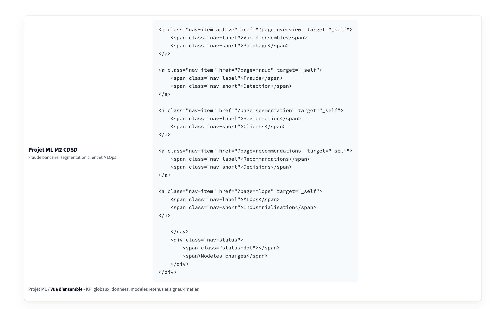

# Plan de presentation finale (12 slides)

## 1) Contexte et objectifs

Message cle :

- Le projet repond a deux besoins metier : reduire le risque de fraude et mieux cibler les clients.

Contenu :

- Detection automatique de transactions frauduleuses.
- Segmentation intelligente des clients.
- Industrialisation via dashboard, API et logique MLOps.

Visuel conseille :

- schema simple : donnees -> modeles -> decisions metier.

## 2) Donnees et contraintes

Message cle :

- Les deux jeux de donnees ont des contraintes differentes : classe rare pour la fraude, interpretation metier pour le clustering.

Contenu :

- Fraude : environ 1 048 575 transactions.
- Taux de fraude : environ 0.109 %.
- Segmentation : 2 240 clients.
- Valeurs manquantes : quelques revenus `Income`.

Visuel conseille :

- tableau comparatif des deux datasets.

## 3) Analyse exploratoire fraude

Message cle :

- La fraude est rare et concentree sur certains types de transaction.

Contenu :

- Fraudes observees surtout sur `TRANSFER` et `CASH_OUT`.
- Importance des soldes avant/apres transaction.
- Recherche d'incoherences comptables.

Visuel conseille :

- barplot du taux de fraude par type de transaction.
- histogramme ou boxplot des montants.

## 4) Analyse exploratoire segmentation

Message cle :

- Les clients se differencient par revenu, depenses, canaux d'achat et sensibilite aux campagnes.

Contenu :

- Distribution du revenu.
- Depenses par categorie.
- Canaux : web, catalogue, magasin, promotions.
- Variables derivees : `Total_Spending`, `Total_Purchases`, `Age`.

Visuel conseille :

- scatterplot revenu vs depense totale.
- heatmap de correlation.

## 5) Pipeline ML fraude

Message cle :

- La performance vient autant du feature engineering que du choix du modele.

Contenu :

- Nettoyage et imputation.
- Encodage de `type`.
- Features de soldes : `origin_error`, `dest_error`, ratios.
- Split train/validation/test stratifie.
- Seuil de decision calibre sur validation.

Visuel conseille :

- pipeline horizontal : raw data -> features -> modele -> score -> seuil.

## 6) Resultats detection de fraude

Message cle :

- XGBoost est retenu car il obtient la meilleure PR-AUC.

Contenu :

- Logistic Regression : PR-AUC 0.7674.
- Random Forest : PR-AUC 0.9864.
- XGBoost : PR-AUC 0.9910.
- XGBoost : precision 1.0000, recall 0.9825, F1 0.9912.
- Sur environ 171 fraudes test, environ 168 sont detectees.

Visuel conseille :

- tableau comparatif des modeles.
- courbe precision/recall ou barplot PR-AUC.

## 7) Pipeline clustering

Message cle :

- Le clustering cherche des segments lisibles, pas seulement un score mathematique.

Contenu :

- Imputation de `Income`.
- Encodage des categories.
- Standardisation.
- Modeles testes : K-Means, Agglomerative, GMM.
- Valeurs testees : 3, 4, 5 et 6 clusters.

Visuel conseille :

- schema du pipeline clustering.

## 8) Resultats segmentation

Message cle :

- Le modele retenu est `gmm_k4`, avec 4 segments exploitables.

Contenu :

- Silhouette : 0.2100.
- Davies-Bouldin : 2.4230.
- Calinski-Harabasz : 305.4055.
- Score modere mais segments interpretables.

Visuel conseille :

- projection PCA coloree par cluster.
- tableau des profils moyens.

## 9) Profils clients et recommandations

Message cle :

- Chaque cluster correspond a une action marketing differente.

Contenu :

- Cluster 0 : faible valeur / faible engagement, 1 132 clients.
- Cluster 1 : promotionnel et digital, 42 clients.
- Cluster 2 : premium tres reactif, 175 clients.
- Cluster 3 : forte valeur stable, 891 clients.

Actions :

- reactivation pour cluster 0 ;
- promotions digitales pour cluster 1 ;
- programme VIP pour cluster 2 ;
- fidelisation et cross-sell pour cluster 3.

Visuel conseille :

- radar chart ou heatmap des profils.

## 10) Industrialisation MVP

Message cle :

- Le projet est deja structure comme une base industrialisable.

Contenu :

- Scripts `src/models/`.
- Modeles sauvegardes dans `models/`.
- API FastAPI dans `src/api/`.
- Dashboard Streamlit dans `dashboard/`.
- Tests avec pytest.

Visuel conseille :

- architecture simple : data -> training -> model registry -> API/dashboard.

## 11) Limites et risques

Message cle :

- Les resultats sont bons, mais doivent etre surveilles en production.

Contenu :

- Desequilibre extreme de la fraude.
- Risque de derive des comportements frauduleux.
- Qualite des soldes a garantir.
- Score silhouette clustering modere.
- Certains clusters sont petits.
- Couts metier FP/FN non encore chiffres.

Visuel conseille :

- tableau risques / impacts / actions.

## 12) Roadmap

Message cle :

- La prochaine evolution est l'interpretabilite et le MLOps.

Contenu :

- Ajouter SHAP pour la fraude.
- Ajouter visualisations avancees des clusters.
- Ajouter MLflow.
- Ajouter DVC ou Git LFS.
- Ajouter CI/CD GitHub Actions.
- Dockeriser API et dashboard.
- Mettre en place monitoring de derive.

Visuel conseille :

- timeline court terme / moyen terme / long terme.
