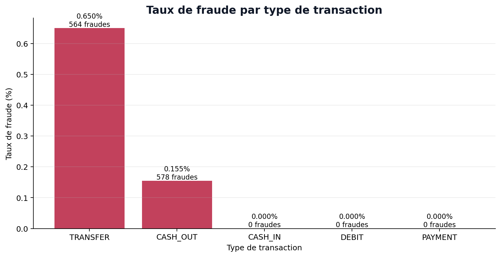
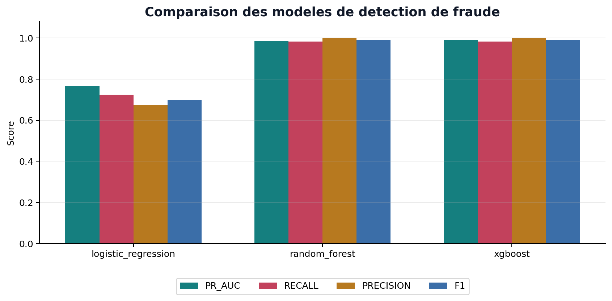
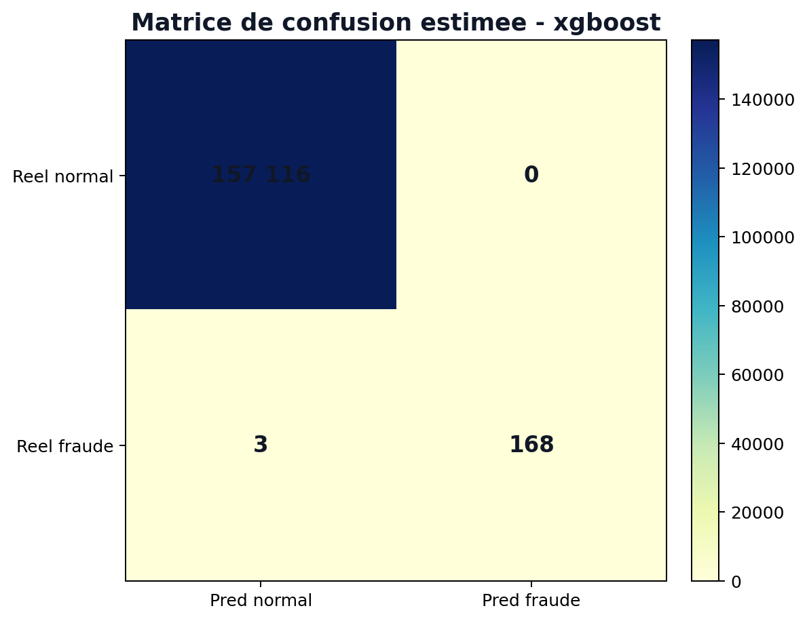
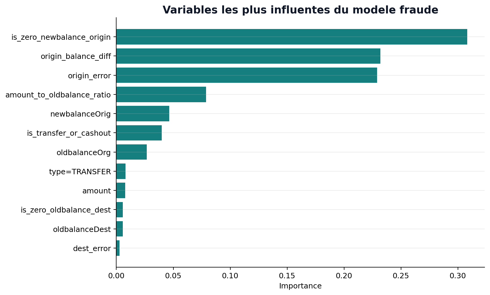
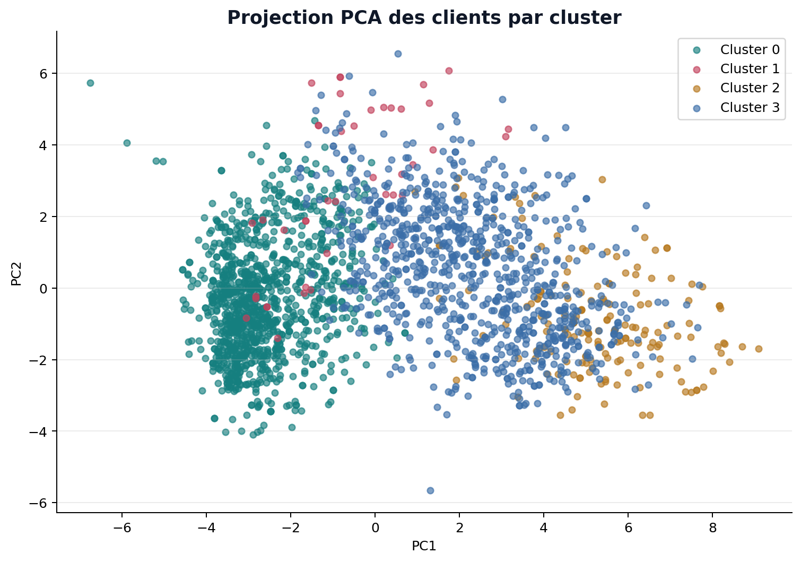
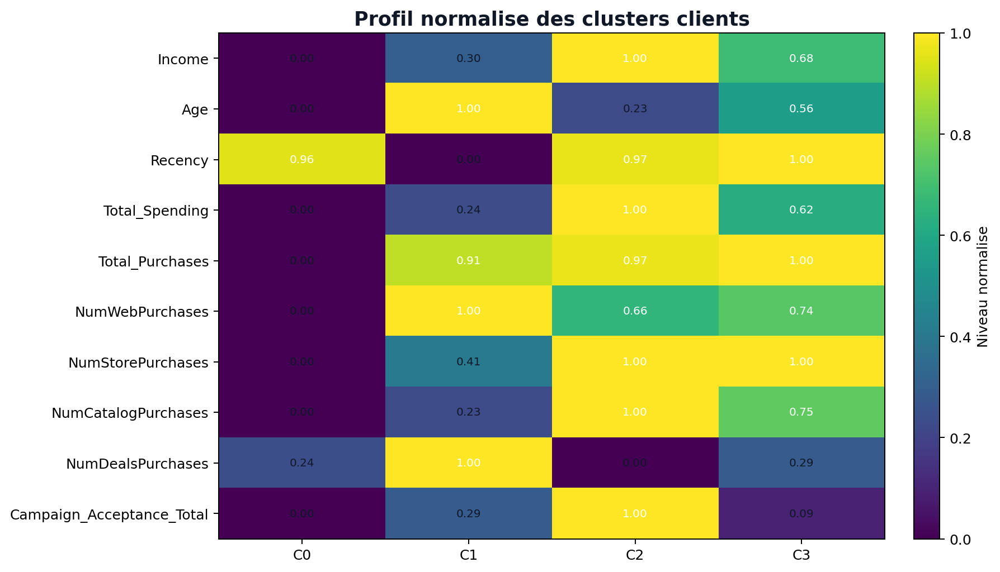

# Rapport d'analyse et d'interprétation
## Fraude bancaire et segmentation client

---

## 1. Synthèse analytique

Ce rapport ne décrit pas seulement la démarche technique : il interprète **ce que disent les données**, **ce que signifient les modèles** et **ce qu'une organisation peut en faire**.

### Constats majeurs

**Sur la fraude**, le jeu de données révèle un phénomène rare (environ **0,11 %** des transactions) mais structuré. Les fraudes ne se répartissent pas au hasard : elles se concentrent sur les types `TRANSFER` et `CASH_OUT`, et s'accompagnent souvent d'**incohérences entre montants et variations de soldes**. Le modèle XGBoost retenu (PR-AUC = **0,991**) classe très bien les transactions suspectes, mais cette performance doit être lue comme un **signal fort du dataset** autant qu'une garantie de performance en production.

**Sur la segmentation**, les clients ne forment pas des groupes parfaitement séparés (silhouette = **0,21**), ce qui est normal en marketing : les comportements évoluent progressivement. Malgré cela, **quatre profils distincts** émergent clairement et permettent des décisions actionnables : un bloc massif peu actif, un noyau premium très réactif, un segment à forte valeur plus stable, et une minorité promotionnelle/digital.

### Message central pour le décideur

| Domaine | Question métier | Réponse de l'analyse |
|---------|-----------------|----------------------|
| Fraude | Faut-il bloquer ou surveiller ? | Prioriser le **rappel** ; calibrer le seuil selon la capacité humaine de traitement des alertes |
| Fraude | Où concentrer les contrôles ? | Sur `TRANSFER` / `CASH_OUT` et les transactions avec écarts de soldes anormaux |
| Marketing | Qui cibler en priorité ? | Cluster 2 (premium réactif) et Cluster 3 (forte valeur) pour la valeur ; Cluster 0 pour la réactivation |
| Marketing | Les segments sont-ils fiables ? | Oui pour orienter des campagnes, non comme vérité absolue — validation métier indispensable |

---

## 2. Problématique et questions d'analyse

### 2.1 Fraude — ce que l'on cherche à comprendre

- Quelles transactions présentent un profil atypique ?
- Le risque est-il lié au montant, au type, ou à la cohérence comptable ?
- Quel compromis accepter entre **fraudes manquées** (coût financier) et **fausses alertes** (coût opérationnel) ?

### 2.2 Segmentation — ce que l'on cherche à comprendre

- Existe-t-il des groupes de clients homogènes en termes de valeur, de canal et de sensibilité aux campagnes ?
- Peut-on relier chaque groupe à une stratégie marketing différente ?
- Les segments sont-ils suffisamment grands et stables pour être exploités ?

### 2.3 Méthodologie expérimentale

#### Détection de fraude

La démarche de modélisation suit une logique supervisée :

1. nettoyage initial des colonnes et suppression des doublons ;
2. construction de variables métier autour des soldes (`origin_error`, `dest_error`, ratio montant/solde, indicateurs de soldes nuls) ;
3. exclusion des identifiants directs (`nameOrig`, `nameDest`) et de `isFlaggedFraud` afin d'éviter une dépendance excessive à un signal déjà issu d'un système de détection ;
4. encodage de `type`, imputation et standardisation via pipeline ;
5. séparation stratifiée train/validation/test ;
6. calibration du seuil sur validation avec contrainte de rappel minimal ;
7. sélection finale sur la **PR-AUC**, plus adaptée que l'accuracy pour une classe rare.

Modèles comparés :

- régression logistique ;
- random forest ;
- XGBoost.

#### Segmentation client

La démarche non supervisée suit une logique de segmentation interprétable :

1. imputation de `Income` par la médiane ;
2. suppression des colonnes constantes (`Z_CostContact`, `Z_Revenue`) ;
3. création de variables métier (`Age`, `Total_Spending`, `Total_Purchases`, ratios par canal, `Campaign_Acceptance_Total`) ;
4. encodage des catégories et standardisation ;
5. comparaison de K-Means, clustering hiérarchique et Gaussian Mixture Model ;
6. test de plusieurs nombres de clusters (`k = 3, 4, 5, 6`) ;
7. choix final fondé sur un compromis entre métriques statistiques et lisibilité métier.

---

## 3. Analyse et interprétation — données de fraude

### 3.1 Un déséquilibre extrême qui change la lecture des métriques

Avec environ **1 fraude pour 920 transactions normales**, une accuracy de 99,9 % peut être obtenue en ignorant quasiment toutes les fraudes. **L'accuracy n'est donc pas une métrique décisionnelle** dans ce contexte.

Les métriques pertinentes sont :

- **Recall (rappel)** : part des fraudes réelles détectées — lié directement au montant de pertes évitées ;
- **Precision** : part des alertes qui sont de vraies fraudes — lié à la charge de travail des équipes ;
- **PR-AUC** : qualité globale du classement sur la classe rare.

**Interprétation** : toute évaluation du modèle doit être présentée au métier en termes de fraudes captées, fraudes manquées et volume d'alertes — pas en pourcentage d'accuracy.

### 3.2 Concentration du risque par type de transaction

L'EDA montre que les fraudes sont quasi absentes sur `PAYMENT`, `CASH_IN` et `DEBIT`, et concentrées sur :

- **TRANSFER** : taux de fraude le plus élevé (~0,65 %) ;
- **CASH_OUT** : taux plus faible mais non négligeable (~0,15 %).



**Interprétation métier** : le risque n'est pas uniforme sur le portefeuille transactionnel. Une politique de contrôle différenciée par type de transaction est justifiée : seuils plus bas ou revue systématique sur `TRANSFER` et `CASH_OUT`, traitement allégé ailleurs.

### 3.3 Les soldes comme signal d'anomalie comptable

Une part importante des transactions présente des écarts entre :

- `oldbalanceOrg - amount` et `newbalanceOrig` ;
- `oldbalanceDest + amount` et `newbalanceDest`.

Les transactions frauduleuses présentent en moyenne des **écarts de solde plus marqués** que les transactions normales.

**Interprétation** : la fraude dans ce dataset semble souvent associée à des mouvements de fonds qui ne respectent pas la logique comptable attendue (vidage de compte, transfert vers compte vide, etc.). Les variables `origin_error`, `dest_error` et les ratios montant/solde ne sont pas de simples features techniques : elles traduisent une **hypothèse métier** — une transaction cohérente doit respecter la conservation des soldes.

### 3.4 Distribution des montants

Les montants sont très asymétriques (queue lourde). Les fraudes peuvent concerner des montants modestes comme très élevés.

**Interprétation** : un filtre basé uniquement sur le montant élevé serait insuffisant. Le modèle doit combiner montant, type et cohérence des soldes.

---

## 4. Analyse et interprétation — données clients

### 4.1 Structure de la base client

- **2 240 clients**, profils hétérogènes en revenu et dépenses ;
- **24 revenus manquants** sur `Income` — impact limité mais nécessite imputation prudente ;
- colonnes `Z_CostContact` et `Z_Revenue` constantes → sans variance, donc sans pouvoir discriminant.

**Note sur les montants** : les valeurs monétaires sont interprétées comme des unités du dataset. Le symbole `€` utilisé dans les tableaux de profils sert uniquement de repère de lecture et ne garantit pas la devise réelle des données.

### 4.2 Relation revenu / dépenses

La relation entre `Income` et `Total_Spending` n'est pas linéaire : certains clients dépensent proportionnellement plus que leur revenu suggère, d'autres restent en dessous de leur capacité théorique.

**Interprétation** : le revenu seul ne définit pas la valeur client. Le comportement d'achat (fréquence, catégories, canaux) apporte une information complémentaire essentielle pour la segmentation.

### 4.3 Canaux d'achat et sensibilité marketing

Les clients se répartissent différemment entre :

- achats **magasin** (canal dominant en moyenne) ;
- achats **web** ;
- achats **catalogue** ;
- achats **promotionnels**.

La variable `Campaign_Acceptance_Total` varie fortement d'un client à l'autre.

**Interprétation** : il existe bien une dimension « canal préféré » et une dimension « sensibilité aux campagnes », exploitables pour personnaliser les actions commerciales.

---

## 5. Interprétation des résultats — détection de fraude

### 5.1 Comparaison des modèles (lecture métier)

| Modèle | PR-AUC | Recall | Precision | Seuil | Lecture |
|--------|-------:|-------:|----------:|------:|---------|
| Régression logistique | 0,767 | 0,725 | 0,674 | 0,98 | Baseline interprétable mais insuffisante pour un usage opérationnel strict |
| Random Forest | 0,986 | 0,983 | 1,000 | 0,52 | Très performant ; seuil bas = modèle confiant rapidement |
| **XGBoost** | **0,991** | **0,983** | **1,000** | **0,84** | **Meilleur classement global ; retenu** |



**Pourquoi XGBoost plutôt que Random Forest ?**  
Les deux atteignent recall et precision identiques sur le test, mais XGBoost présente la **meilleure PR-AUC** (0,991 vs 0,986), signe d'un meilleur classement des cas les plus ambigus — utile pour prioriser les alertes.

**Pourquoi pas la régression logistique ?**  
Elle reste utile comme modèle explicable (coefficients), mais avec un recall de 0,725 elle laisserait échapper environ **27 % des fraudes** au seuil retenu — inacceptable si la priorité est de minimiser les pertes.

### 5.2 Lecture de la matrice de confusion (estimation test)

Sur le jeu de test (~157 000 transactions, ~171 fraudes) :

- **Fraudes détectées** : ~168 (recall 98,3 %) ;
- **Fraudes manquées** : ~3 ;
- **Faux positifs** : 0 au seuil retenu (precision 100 %).



**Interprétation prudente** :  
Un score parfait en precision sur un seul jeu de test est **atypique en conditions réelles**. Cela peut indiquer :

1. un dataset très séparable (signaux de soldes très forts) ;
2. un seuil élevé (0,84) qui ne déclenche que les cas les plus évidents ;
3. un risque de **sur-apprentissage** ou de fuite indirecte si les variables de solde reflètent mécaniquement le label.

**Recommandation** : valider sur une période temporelle future (`step` non vue) avant tout déploiement automatique de blocage.

### 5.3 Le seuil de décision comme choix métier

Le seuil 0,84 signifie : « alerter seulement lorsque le modèle est très confiant ».

| Si on baisse le seuil | Effet |
|-----------------------|-------|
| Recall ↑ | Plus de fraudes captées |
| Precision ↓ probable | Plus de fausses alertes, surcharge des analystes |

**Interprétation** : le seuil n'est pas un paramètre technique secondaire — c'est le **traducteur entre performance statistique et politique de risque**. Il doit être recalibré avec les équipes en fonction du nombre d'alertes traitables par jour.

### 5.4 Variables explicatives du modèle

L'importance des variables confirme que le modèle s'appuie fortement sur des signaux cohérents avec l'analyse métier : type de transaction, montants, soldes et variables dérivées d'incohérence.



**Interprétation** : cette lecture ne remplace pas une analyse SHAP, mais elle donne déjà un contrôle de cohérence. Si les variables les plus importantes étaient des identifiants techniques ou des colonnes impossibles à connaître en production, cela signalerait un risque de fuite de données. Ici, les signaux dominants restent compatibles avec une logique opérationnelle.

### 5.5 Typologie des cas difficiles (hypothèses)

Même avec un excellent modèle, certains cas restent difficiles :

- fraudes mimant des transactions légitimes (soldes cohérents) ;
- montants faibles noyés dans le bruit ;
- nouveaux schémas de fraude non représentés dans l'historique.

**Interprétation** : le modèle doit être vu comme un **filtre intelligent**, pas comme un substitut complet à l'expertise humaine.

---

## 6. Interprétation des résultats — segmentation client

### 6.1 Qualité mathématique vs utilité métier

Le modèle retenu (`GMM`, k = 4) affiche :

- **Silhouette : 0,21** → séparation modérée ;
- **Davies-Bouldin : 2,42** → clusters pas parfaitement compacts ;
- **Calinski-Harabasz : 305** → structure globale présente.



**Interprétation** : un score silhouette faible ne signifie pas que la segmentation est inutile. En marketing, les clients occupent souvent un **continuum** (du client occasionnel au client premium). L'objectif n'est pas la perfection mathématique mais la **lisibilité des personas** et leur **actionnabilité**.

Le choix de 4 clusters est justifié car il produit des profils contrastés sans fragmenter excessivement la base.

### 6.2 Personas interprétés

#### Cluster 0 — « Dormants à faible valeur » (50,5 % de la base)

| Indicateur | Valeur moyenne | Lecture |
|------------|---------------:|---------|
| Revenu | 36 572 € | Moyen, mais sous-exploité |
| Dépense totale | 124 € | Très faible |
| Acceptation campagnes | 0,15 | Quasi insensible |

**Interprétation** : ce n'est pas nécessairement un segment « pauvre » — c'est surtout un segment **désengagé**. Le faible revenu n'explique pas à lui seul la faible dépense (comparer au cluster 1, revenu similaire mais dépenses 4× supérieures).

**Enjeu** : réactivation à faible coût. Campagnes massives peu coûteuses plutôt que personnalisation lourde.

---

#### Cluster 1 — « Chasseurs de promotions digitaux » (1,9 % de la base)

| Indicateur | Valeur moyenne | Lecture |
|------------|---------------:|---------|
| Revenu | 49 682 € | Intermédiaire |
| Dépense totale | 467 € | Modérée mais active |
| Achats web | 6,98 | Canal dominant |
| Achats promo | 5,71 | Très élevé |
| Acceptation campagnes | 0,86 | Très réactive |

**Interprétation** : segment **petit mais hyper-réactif** aux offres. Comportement typique du client qui achète quand il y a une réduction, surtout en ligne. Âge moyen élevé (62 ans) : ne pas associer automatiquement « digital » à « jeune ».

**Enjeu** : ROI élevé sur campagnes ciblées (coupons, flash sales web). Attention au risque de **cannibalisation des marges**.

---

#### Cluster 2 — « Premium ultra-engagés » (7,8 % de la base)

| Indicateur | Valeur moyenne | Lecture |
|------------|---------------:|---------|
| Revenu | 80 575 € | Élevé |
| Dépense totale | 1 584 € | Très élevée (×12 vs cluster 0) |
| Achats magasin | 8,28 | Canal privilégié |
| Acceptation campagnes | 2,58 | La plus élevée |

**Interprétation** : cœur de la **valeur économique**. Clients à fort pouvoir d'achat, dépenses élevées, omnicanal (magasin + catalogue), et forte réponse aux campagnes. Ce segment combine **valeur** et **réactivité** — profil rare et précieux.

**Enjeu** : programme VIP, relation personnalisée, avant-premières. Éviter les promotions agressives qui pourraient dégrader l'image premium.

---

#### Cluster 3 — « Fidèles à forte valeur » (39,8 % de la base)

| Indicateur | Valeur moyenne | Lecture |
|------------|---------------:|---------|
| Revenu | 66 696 € | Élevé |
| Dépense totale | 1 033 € | Élevée |
| Achats magasin | 8,27 | Canal dominant |
| Acceptation campagnes | 0,38 | Faible |

**Interprétation** : segment **massif et rentable**, mais moins sensible aux campagnes que le cluster 2. Comportement de client fidèle qui achète régulièrement en magasin sans attendre de promotion. La dépense est élevée par **habitude**, pas par réactivité promotionnelle.

**Enjeu** : fidélisation, cross-sell, parcours omnicanal. Ne pas les bombarder de promotions (faible ROI, risque de lassitude).

---

### 6.3 Carte stratégique des segments



```
                    DÉPENSE ÉLEVÉE
                         │
         Cluster 2       │       Cluster 3
      (premium réactif)  │    (fidèles stables)
                         │
  ───────────────────────┼─────────────────────── RÉACTIVITÉ CAMPAGNES
                         │
         Cluster 0       │       Cluster 1
        (dormants)       │   (promo digitaux)
                         │
                    DÉPENSE FAIBLE
```

**Interprétation** : la segmentation révèle deux axes indépendants — **valeur/dépense** et **sensibilité aux campagnes** — qui ne se confondent pas. Un client riche (cluster 3) n'est pas forcément réactif aux promotions (contrairement au cluster 2).

---

## 7. Recommandations stratégiques

### 7.1 Fraude — politique de décision proposée

| Niveau de score | Action recommandée | Justification |
|-----------------|-------------------|---------------|
| Score ≥ 0,84 (seuil actuel) | Alerte prioritaire + vérification | Confiance élevée du modèle |
| Score 0,50 – 0,84 | Revue humaine si type = TRANSFER/CASH_OUT | Zone grise — équilibre coût/risque |
| Score < 0,50 | Traitement standard | Risque faible sur historique |

**Priorités opérationnelles** :

1. Traiter en priorité les alertes `TRANSFER` / `CASH_OUT` avec écarts de soldes ;
2. Mesurer mensuellement recall, precision et volume d'alertes ;
3. Analyser systématiquement les **3 fraudes manquées** (estimation test) pour comprendre les schémas non captés ;
4. Ne pas déployer de blocage automatique sans validation temporelle.

### 7.2 Marketing — plan d'action par segment

| Segment | Taille | Priorité | Action clé | KPI de succès |
|---------|-------:|----------|------------|---------------|
| 0 — Dormants | 1 132 | Moyenne | Réactivation email/promo légère | Taux de réactivation |
| 1 — Promo digitaux | 42 | Haute (ROI) | Coupons web personnalisés | Taux de conversion promo |
| 2 — Premium réactifs | 175 | **Critique** | Programme VIP | CLV, fréquence achat |
| 3 — Fidèles stables | 891 | **Critique** | Cross-sell omnicanal | Panier moyen, rétention |

### 7.3 Prédiction et déploiement

Le projet dispose déjà d'une couche de prédiction exploitable :

- **Dashboard Streamlit** : permet de visualiser les résultats, tester une transaction et attribuer un segment à un client ;
- **API FastAPI** : expose les endpoints `/predict/fraud` et `/predict/segment` ;
- **Modèles sauvegardés** : les pipelines `joblib` incluent preprocessing + modèle, ce qui limite le risque d'incohérence entre entraînement et inférence.

#### Exemple de sortie attendue — fraude

```json
{
  "prediction": 1,
  "probability": 0.92,
  "threshold": 0.84,
  "model": "xgboost"
}
```

**Lecture métier** : une transaction avec une probabilité supérieure au seuil est envoyée en alerte prioritaire. La probabilité permet aussi de trier les alertes par urgence.

#### Exemple de sortie attendue — segmentation

```json
{
  "segment": 2,
  "model": "gmm_k4",
  "n_input_features": 39
}
```

**Lecture métier** : le segment doit être relié à la table de personas. Par exemple, le segment 2 correspond aux clients premium ultra-engagés et appelle une stratégie VIP/personnalisée.

#### Architecture de déploiement recommandée

| Brique | Rôle | Technologie actuelle |
|--------|------|---------------------|
| Dashboard | Démonstration, analyse et prédiction interactive | Streamlit |
| API | Scoring programmé par requête HTTP | FastAPI |
| Modèles | Artefacts d'inférence | `joblib` |
| Données | Sources brutes et résultats de modélisation | CSV |
| Monitoring cible | Suivi performance et dérive | MLflow / Evidently AI à ajouter |

---

## 8. Limites, biais et prudence interprétative

### 8.1 Fraude

| Limite | Impact sur l'interprétation |
|--------|----------------------------|
| Dataset potentiellement synthétique ou très structuré | Performance peut être optimiste vs production |
| Pas de validation temporelle stricte | Risque de sur-estimation si les fraudes changent de schéma |
| Variables de soldes très prédictives | Si qualité des soldes dégradée en prod, performance chute |
| Coûts FP/FN non chiffrés | Impossible de justifier formellement le seuil 0,84 |
| `isFlaggedFraud` exclu | Correct méthodologiquement, mais le modèle ne reproduit pas le système existant |

### 8.2 Segmentation

| Limite | Impact sur l'interprétation |
|--------|----------------------------|
| Silhouette modérée (0,21) | Frontières entre clusters floues — certains clients sont « entre deux » |
| Cluster 1 très petit (42) | Statistiques instables ; campagnes à tester prudemment |
| Pas d'historique temporel | Segments peuvent évoluer ; recalcul périodique nécessaire |
| `Response` exclu du clustering | Le modèle ne prédit pas directement la conversion future |

### 8.3 Biais généraux

- **Biais de sur-confiance** : des métriques excellentes peuvent masquer un dataset trop facile ;
- **Biais de staticité** : les profils sont une photographie, pas une vidéo ;
- **Biais d'action** : un segment n'est utile que si une action concrète lui est associée.

---

## 9. Conclusion analytique

### Ce que les données nous apprennent

1. **La fraude est un phénomène rare, concentré et structurellement détectable** — surtout via les incohérences de soldes et les types de transaction à risque.

2. **Les modèles avancés (XGBoost) apportent un gain réel** par rapport à une baseline logistique, mais le choix du seuil reste un arbitrage métier, pas un choix statistique pur.

3. **La base client n'est pas homogène** : quatre personas distincts émergent, avec des logiques économiques différentes (dormance, chasse aux promos, premium réactif, fidélité stable).

4. **La segmentation marketing et la détection de fraude répondent à des logiques opposées** : en fraude, on cherche la rareté et l'anomalie ; en marketing, on cherche la régularité et la ressemblance. Les deux démarches sont complémentaires.

### Ce qui reste à confirmer

L'analyse actuelle permet de formuler des recommandations, mais plusieurs points méritent une validation supplémentaire avant toute généralisation :

- **Explicabilité des alertes fraude** : le modèle performe, mais sans analyse des contributions individuelles (ex. SHAP), il reste difficile d'expliquer au métier *pourquoi* une transaction est bloquée — ce qui limite la confiance des équipes de revue manuelle.
- **Robustesse dans le temps** : les résultats sont évalués sur un split aléatoire ; une découpe par période (`step`) vérifierait si le modèle tient face à l'évolution des schémas de fraude.
- **Actionnabilité des segments** : les profils clusters 0 et 1 (dormants et promo-chasseurs) sont les plus incertains statistiquement ; seule une campagne test mesurerait si la segmentation se traduit en réactivation ou en ROI réel.
- **Stabilité des personas** : sans recalcul périodique, on ne sait pas si les quatre segments restent valides ou si les clients migrent d'un profil à l'autre au fil des trimestres.
